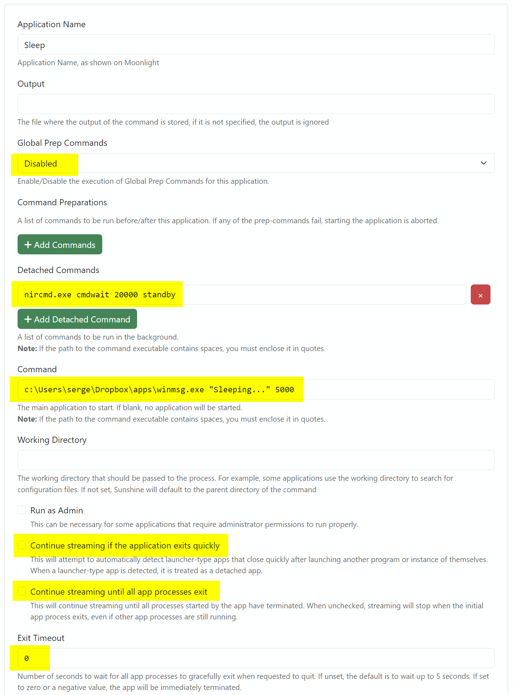
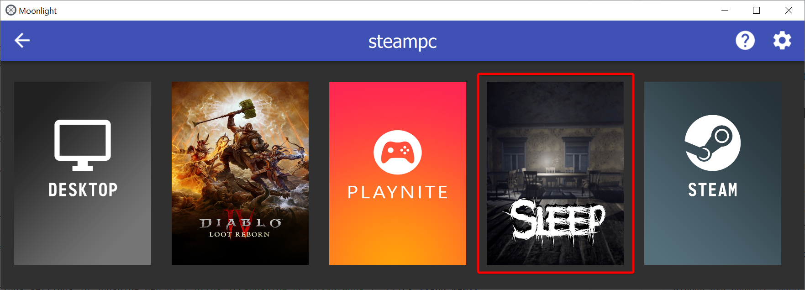

### WinMsg

This is a very basic Windows GUI application that takes a **message** to display and a **timeout** as the parameters
and does exactly that. The message is displayed in the center of the black **full-screen** window in large white text,
then the app exits automatically.


I wrote it for [Sunshine](https://github.com/LizardByte/Sunshine) / [Moonlight](https://github.com/moonlight-stream)
streaming as a companion application when running command-line tools on a host via Moonlight.

The common use case is to control the host PC state (**Shut down** / **Sleep** / **Hibernate**) with the tools
like [NirCmd](https://www.nirsoft.net/utils/nircmd.html).

Instead of the black screen and an error dialog, if the connection is aborted unexpectedly, the user will see the
message from this app, then the stream will close gracefully after the app exists.

This project page and documentation below also serve as a guide how to set up sleep/shutdown via Sunshine app
shortcuts for Moonlight so that you can manually control your host state directly from a client.

Of course, there are other solutions for that:

- add an **Undo** command in Sunshine to run a tool that will suspend the PC when the app you stream exists
- configure Windows Power profile to sleep/hibernate/shutdown after N minutes of inactivity
- if streaming from Steam Deck,
  use [MoonDeck](https://github.com/FrogTheFrog/moondeck)/[MoonDeck Buddy](https://github.com/FrogTheFrog/moondeck-buddy)
  to control the PC state
- for true nerds, use HomeAssistant with [HASS Agent](https://github.com/hass-agent/HASS.Agent) and
  a [WOL switch](https://www.home-assistant.io/integrations/wake_on_lan/) so that you can control the host PC via voice
  commands, HA dashboard, CLI and automations

While all the above will work just fine, sometimes you may want to manually force the streaming host to sleep directly
from the client. That is where the blow guide should help.

### Usage

```
winmsg.exe [<message>] [<timeout>]
```

The message is the actual message to display, make sure to surround it with double quotes if it contains spaces.
Timeout is the time in milliseconds to display the message. The app exits after timeout.

Example:

```commandline
winmsg.exe "Going to sleep..." 5000
```

This will show the "Going to sleep..." message in the center of the black screen and exit after 5 seconds (5000ms).

If no parameters are provided, the app will show the empty black screen with no text and exit after 5 seconds.

### Sample Sunshine Application configuration to suspend the PC via NirCmd

<details>
  <summary>Click to show the screenshot</summary>


</details>

Open Applications settings in Sunshine Web UI (`https://<sunshine-pc:47990/apps`), click **Add New**.

Make sure to download and install [NirCmd](https://www.nirsoft.net/utils/nircmd.html) so that it's available in your
PATH (or adjust the **Detached Command** to use the full path to `nircmd.exe`). This app can do many things, including
putting the PC in sleep mode (`standby` command), shutting down the PC (`exitwin shutdown`),
rebooting (`exitwin reboot`), and [much more](https://www.nirsoft.net/utils/nircmd2.html#using).

In this example, we use the following command in the **Detached Commands** section (to be run in the background):

```commandline
nircmd.exe cmdwait 20000 standby
```

`cmdwait 20000` waits 20 seconds before forcing the PC to sleep, this allows Moonlight to disconnect properly and
Sunshine to run "Undo" commands, if needed. Feel free to use a shorter delay.

As the main **Command** we use this 'winmsg.exe' tool to display a message and exit after timeout:

```commandline
winmsg.exe "Sleeping..." 5000
```

Recommended options:

- **Global Prep Commands**: _Disabled_ — this allows the command to run faster as the global Do/Undo commands will not
  run
- **Continue streaming if the application exits quickly**: _Uncheck_ — the app will quick quickly anyway, we don't want
  any special handling by Sunshine
- **Continue streaming until all app processes exit**: _Uncheck_ — also not needed for our case
- **Exit Timeout**: 0 — for faster exit if forced by the client
- `cmdwait` value should be greater than `winmsg` timeout (20000 > 5000 in this example)

If you run the configured **Sleep** app via Moonlight, it will start the streaming session, run the `nircmd.exe` in
background with the timeout, run `winmsg.exe` as your main streaming app, you will see the specified message, after
5 seconds the app will exit, Moonlight will close the streaming session and then the PC with Sunshine will go to sleep
after ~15 more seconds.

<details>
  <summary>Click for Moonlight Sleep shortcut sample</summary>


</details>

### Compiling

This project can be built on Windows with [MinGW](https://www.mingw-w64.org/downloads/#mingw-builds)/CMake.

Inside `mingw64` shell, `cd` into the project root directory, then:

```commandline
pacman -S mingw-w64-x86_64-ninja
pacman -S mingw-w64-x86_64-cmake
mkdir build
cd build
cmake ..
cmake --build . --config Release
```

`winmsg.exe` file will be in the `build` directory.

You can also use [JetBrains CLion IDE](https://www.jetbrains.com/clion/) to open this project and build it right away
as it already comes with MinGW toolchain and CMake build tool.

Or just download the pre-compiled binary from the **Releases** page.